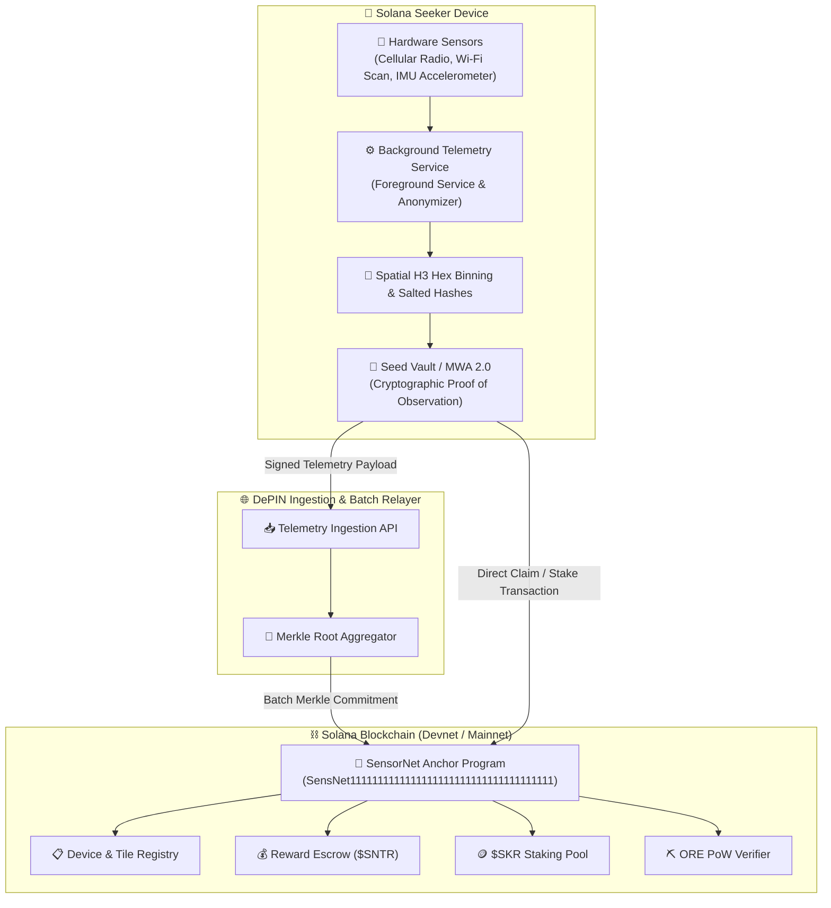

# 🛰️ SensorNet — Mobile DePIN for Solana Seeker

[](https://solanamobile.com)
[](https://github.com/solana-mobile/mobile-wallet-adapter)
[](https://solanamobile.radiant.nexus/)
[](https://opensource.org/licenses/MIT)

> **SensorNet** is a decentralized physical infrastructure network (DePIN) designed from the ground up for the **Solana Seeker** smartphone. It runs as a low-power, privacy-preserving background service, crowd-sourcing anonymous cellular network coverage (5G/LTE), Wi-Fi node density, and road surface vibration dynamics in exchange for on-chain micro-rewards ($SNTR), with multi-tiered staking via **$SKR** and anti-sybil proof-of-work powered by the **ORE** protocol.

---

## ⚡ Key Highlights & Hackathon Tracks

* **Mobile-First Android Application:** Built natively with Kotlin and React Native, featuring battery-optimized foreground services, IMU peak vibration filters, and telephony listeners.
* **Seed Vault & MWA 2.0:** Secure hardware transaction signing directly from the Seeker's secure enclave without exposing private keys.
* **$SKR Token Integration ($10,000 Bounty):** Users stake Radiants $SKR to increase their spatial telemetry reward multiplier (+25% to +100% boost).
* **ORE Protocol PoW Verifier (Matched Prize):** Integrates lightweight background proof-of-work challenges while the phone charges to prevent sybil attacks and earn bonus yield.
* **Spatial Privacy (Uber H3 Binning):** Zero personal trajectory leakage. All spatial metrics are mapped to anonymized H3 hexagonal cells with salted MAC hashes.
* **Stickiness & Daily Active Engagement (25% PMF):** Daily streak rewards (🔥 Streak Multipliers), live hexagonal coverage map, and instant micro-reward claims.

---

## 🏛️ System Architecture



---

## 📁 Repository Structure

```
sensornet/
├── android/                   # Native Android OS & Seeker hardware modules
│   ├── app/
│   │   ├── src/main/AndroidManifest.xml  # Foreground & sensor permissions
│   │   └── src/main/kotlin/net/sensornet/app/
│   │       ├── services/TelemetryCollectorService.kt  # Battery-optimized service
│   │       ├── sensors/CellularCollector.kt          # 5G/LTE signal strength (dBm)
│   │       ├── sensors/WifiCollector.kt              # Salted Wi-Fi density scanner
│   │       ├── sensors/RoadRoughnessCollector.kt     # Accelerometer pothole detection
│   │       └── solana/SeedVaultManager.kt            # Native MWA 2.0 client bridge
│   └── build.gradle
├── contracts/                 # Solana Anchor Smart Contract
│   ├── programs/sensornet/src/lib.rs  # On-chain DePIN logic, SKR staking & ORE PoW
│   ├── Anchor.toml
│   └── Cargo.toml
├── src/                       # React Native Mobile Application
│   ├── components/            # HexMap, MetricCard, Header
│   ├── screens/               # Dashboard, Staking ($SKR/ORE), Rewards
│   ├── services/              # Telemetry simulation & bridge
│   ├── solana/                # Mobile Wallet Adapter Web3 client
│   └── theme/                 # Cyberpunk DePIN color system
├── relayer/                   # Ingestion & Merkle batch committer service
├── docs/                      # Pitch deck, 3-min demo video script, technical spec
└── App.tsx                    # Root mobile entry point
```

---

## 🚀 Quick Start & Building the APK

### 1. Requirements
* Node.js v18+ / v20+
* Android Studio (Koala or Jellyfish) with Android SDK 34
* Rust & Solana CLI v1.18+ (for smart contract)
* Anchor v0.30.1

### 2. Install Dependencies
```bash
npm install
```

### 3. Run on Android Device / Seeker Emulator
```bash
# Verify Solana Mobile development environment
npx solana-mobile@latest doctor

# Launch the official Seeker emulator
npx solana-mobile@latest emulator

# Run application on emulator/device
npx react-native run-android
```

### 4. Build Release Android APK
```bash
cd android
./gradlew assembleRelease
# The standalone APK will be generated at:
# android/app/build/outputs/apk/release/app-release.apk
```

---

## 🪙 Tokenomics & Partner Integrations

| Feature | Mechanism | Hackathon Alignment |
| :--- | :--- | :--- |
| **$SNTR Micro-Rewards** | Minted per validated hex tile mapped (cellular, Wi-Fi, road). | Core DePIN economic loop |
| **$SKR Staking Boost** | Tier 1 (1,000 SKR): +25% • Tier 2 (5,000 SKR): +50% • Tier 3 (20,000 SKR): +100% | **$10,000 SKR Bounty Track** |
| **ORE PoW Verification** | Background CPU hash verification during idle charging for anti-sybil defense. | **ORE Matched Prize Track (up to $30,000)** |
| **Seeker Hardware Pass** | Seed Vault hardware attestation gives an innate **+20% permanent boost**. | Seeker First-Class Citizen |

---

## 🔒 Privacy & Cryptographic Verification

1. **No Real-Time Trajectory Storing:** The app converts raw GPS points into Uber H3 spatial indexes (Resolution 8, ~460m diameter). Only the tile ID is reported, preventing route tracing.
2. **Salted Wi-Fi MACs:** BSSID addresses are hashed with a daily rotating cryptographic salt, making reverse-lookup impossible while preserving uniqueness.
3. **Pavement IRI Anomaly Detection:** Road roughness values are aggregated using high-pass dynamic accelerometer filtering, tagging road infrastructure degradation for civic data buyers.
